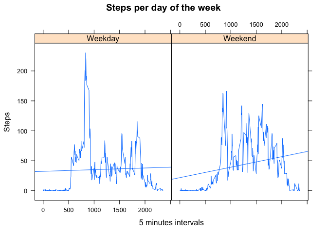

# Reproducible Research: Peer Assessment 1


## Loading and preprocessing the data

```r
unzip("activity.zip")
activity_raw <- read.csv("activity.csv", stringsAsFactors=F)
activity <- na.omit(activity_raw)
#activity$id <- paste(activity$date, " ", activity$interval)
#activity$date <- strptime(activity$date, format="%Y-%m-%d")
```


## What is mean total number of steps taken per day?


```r
steps_per_day <- aggregate(steps~date, activity, sum)
hist(steps_per_day$steps, main="Number os steps per day", xlab="Number os steps", ylab="Days")
```

 

Mean number of steps per day:

```r
mean(steps_per_day$steps)
```

```
## [1] 10766.19
```

Median number of steps:

```r
median(steps_per_day$steps)
```

```
## [1] 10765
```

## What is the average daily activity pattern?

```r
steps_per_5_min <- aggregate(steps~interval, activity, mean)
plot(steps_per_5_min$interval, steps_per_5_min$steps, type="l", xlab="5 minute interval", ylab="Average steps")
```

 

Interval containing the maximum number of steps:

```r
steps_per_5_min[steps_per_5_min$steps == max(steps_per_5_min$steps),]$interval
```

```
## [1] 835
```

## Imputing missing values

Total number os cases where one of the values is NA:

```r
sum(!complete.cases(activity_raw))
```

```
## [1] 2304
```

In order to fill in all the missing data, we will use the average number of steps for that interval:

```r
activity_fill <- activity_raw
for(row in 1:length(activity_fill$steps)) {
  if (is.na(activity_fill[row,]$steps)) {
    activity_fill[row,]$steps <- steps_per_5_min[steps_per_5_min$interval == activity_fill[row,]$interval,]$steps
  }
}
```


```r
steps_fill_per_day <- aggregate(steps~date, activity_fill, sum)
hist(steps_fill_per_day$steps, main="Number os steps per day (NAs = average per day)", xlab="Number os steps", ylab="Days")
```

 

Mean number of steps per day does not change is compared to the average where NAs are ignored:

```r
mean(steps_fill_per_day$steps)
```

```
## [1] 10766.19
```

On the other hand, median number of steps does change:

```r
median(steps_fill_per_day$steps)
```

```
## [1] 10766.19
```

## Are there differences in activity patterns between weekdays and weekends?

Weekdays show more activity earlier if compared to weekends. On the other hand, weekdays shows less activity through the rest of the day.


```r
activity_fill$day_of_week <- weekdays(strptime(activity_fill$date, format="%Y-%m-%d"))
activity_fill$weekend <- factor(ifelse(activity_fill$day_of_week %in% c("Saturday", "Sunday"), "Weekend", "Weekday"))
steps_per_5_min_weekday <- aggregate(steps~interval+weekend, activity_fill, mean)
library(lattice)
xyplot(steps~interval|weekend,
       data=steps_per_5_min_weekday,
       type=c("l","r"),
       main="Steps per day of the week", 
       ylab="Steps", xlab="5 minutes intervals");
```

 
